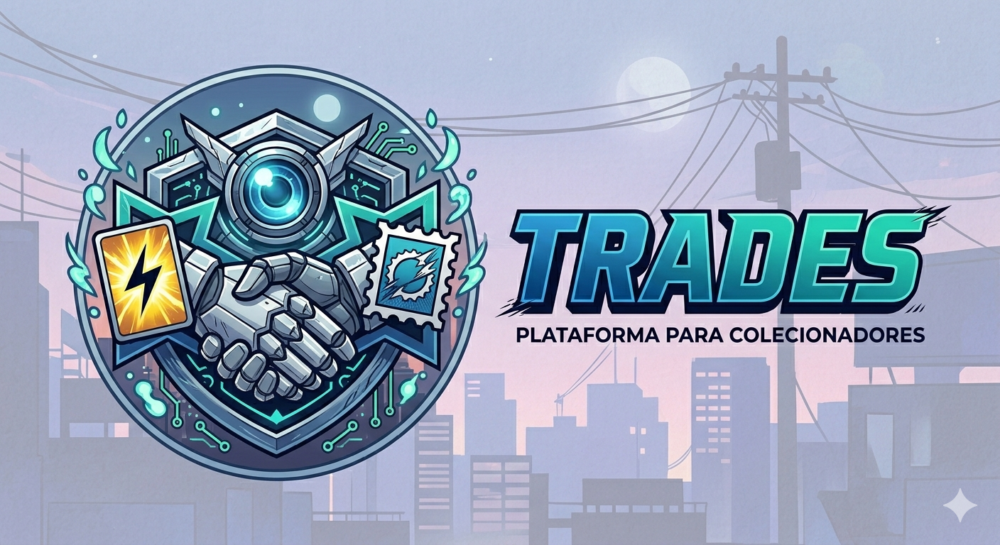

# 🛡️ Trades: O Hub dos Colecionadores

[](https://github.com/seu-usuario/trades/blob/main/LICENSE)
[](http://makeapullrequest.com)

**Trades** é uma plataforma robusta projetada para colecionadores que buscam profissionalismo na gestão de seus itens. De cartas Pokémon a selos e moedas raras, a plataforma facilita a organização de inventários e conecta utilizadores para trocas seguras e inteligentes.

[Explore a Demo] · [Reporte um Bug] · [Solicite uma Feature]

---

## 🚀 Sobre o Projeto

Gerir coleções físicas pode ser um desafio logístico. O **Trades** resolve isso centralizando o inventário numa interface intuitiva, permitindo que o utilizador visualize a sua coleção e encontre parceiros de troca com base em interesses mútuos (Matchmaking de itens).

### Principais Funcionalidades

* **🗃️ Gestão Multidomínio:** Suporte para diferentes categorias (Pokémon TCG, Numismática, Filatelia).
* **🔄 Smart Trading:** Sistema de propostas de troca com status em tempo real.
* **📊 Dashboard de Inventário:** Visão geral da quantidade, raridade e estado de conservação dos itens.
* **🔍 Busca Avançada:** Filtros por edição, ano, raridade ou valor estimado.

---

## 🛠️ Tecnologias Utilizadas

Este projeto foi construído utilizando as melhores práticas de desenvolvimento de software, visando escalabilidade e performance:

* **Frontend:** [Inserir Tecnologia, ex: Next.js]
* **Backend:** [Inserir Tecnologia, ex: Node.js / NestJS]
* **Banco de Dados:** [Inserir Tecnologia, ex: PostgreSQL / MongoDB]
* **Autenticação:** [Inserir Tecnologia, ex: Clerk / Firebase]
* **Estilização:** [Inserir Tecnologia, ex: Tailwind CSS]

---

## 📐 Arquitetura e Boas Práticas

Para demonstrar a qualidade do código aos recrutadores, o projeto segue:
* **Clean Code:** Nomes semânticos e funções de responsabilidade única.
* **Arquitetura:** [Ex: Clean Architecture / Hexagonal] para desacoplamento de regras de negócio.
* **Mobile First:** Interface totalmente responsiva.
* **Versionamento:** Commits semânticos (Conventional Commits).

---

## ⚙️ Como Executar o Projeto

1.  **Clone o repositório:**
    ```bash
    git clone https://github.com/seu-usuario/trades.git
    ```
2.  **Instale as dependências:**
    ```bash
    npm install
    ```
3.  **Configure as variáveis de ambiente:**
    * Crie um arquivo `.env` na raiz e adicione suas chaves seguindo o `.env.example`.
4.  **Inicie o servidor de desenvolvimento:**
    ```bash
    npm run dev
    ```

---

## 🎯 Roadmap de Evolução

- [ ] Integração com APIs externas para precificação em tempo real.
- [ ] Sistema de reputação para utilizadores (avaliações após trocas).
- [ ] Chat interno para negociação.
- [ ] Geração de relatórios de coleção em PDF/CSV.

---

## 📄 Licença

Distribuído sob a licença MIT. Veja o ficheiro `LICENSE` para mais informações.

---

## ✉️ Contacto

**Seu Nome** - [LinkedIn](https://linkedin.com/in/seu-perfil) - seu-email@exemplo.com

Link do Projeto: [https://github.com/seu-usuario/trades](https://github.com/seu-usuario/trades)

---
*Desenvolvido com ☕ e foco em colecionismo.*
