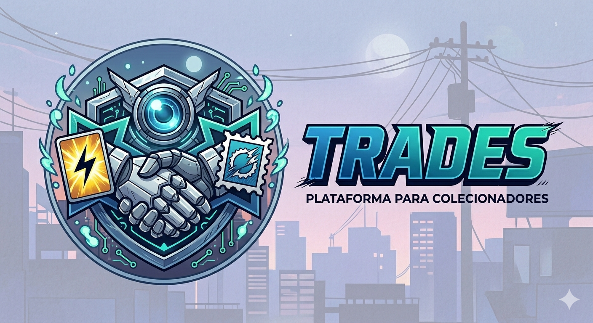

<div align="center">
  
</div>

# 🛡️ Trades: O Hub dos Colecionadores

[](https://github.com/seu-usuario/trades/blob/main/LICENSE)
[](http://makeapullrequest.com)

**Trades** é uma API REST desenvolvida em Node.js e TypeScript projetada para a gestão de colecionáveis e mediação de trocas entre usuários. A plataforma permite o cadastro de colecionadores, controle de inventários e automação no aceite de propostas de troca.

---

## 🚀 Sobre o Projeto

Projeto desenvolvido para a Avaliação Parcial (P1) da disciplina de Desenvolvimento Web. A API segue os princípios de **Clean Architecture** utilizando o padrão *In-Memory Repository*, garantindo desacoplamento entre a camada de negócio e a infraestrutura.

### Principais Funcionalidades

* **🗃️ Gestão de Colecionadores:** Cadastro e consulta de perfis na plataforma.
* **📦 Controle de Inventário:** Cadastro de itens vinculados a colecionadores específicos.
* **🔄 Sistema de Trocas:** Criação de propostas de troca entre dois colecionadores.
* **⚡ Transferência Automática:** Atualização instantânea da propriedade do item (`colecionadorId`) ao aceitar uma proposta (`PATCH`).

---

## 🛠️ Tecnologias Utilizadas

* **Runtime:** Node.js
* **Linguagem:** TypeScript
* **Framework Web:** Express
* **Documentação:** Swagger UI (`swagger-ui-express`)
* **Arquitetura:** Clean Architecture (Services, Repositories, Controllers e Factories)

---

## 📖 Documentação da API (Swagger)

Com o servidor rodando, a documentação interativa com todas as rotas e esquemas pode ser acessada em:

👉 **`http://localhost:3000/docs`**

### Rotas Principais

| Método | Endpoint | Descrição |
| :--- | :--- | :--- |
| `POST` | `/api/colecionadores` | Cadastra um novo colecionador |
| `GET` | `/api/colecionadores` | Lista todos os colecionadores |
| `POST` | `/api/itens` | Cadastra um novo item de coleção |
| `GET` | `/api/itens/:id` | Busca detalhes de um item por ID |
| `POST` | `/api/propostas` | Cria uma nova proposta de troca |
| `PATCH` | `/api/propostas/:id/responder` | Aceita ou recusa uma proposta de troca |

---

## ⚙️ Como Executar o Projeto

1. **Clone o repositório:**
   ```bash
   git clone https://github.com/SEU-USUARIO/trades.git
   ```

2. **Instale as dependências:**
   ```bash
   npm install
   ```

3. **Inicie o servidor de desenvolvimento:**
   ```bash
   npm run dev
   ```

4. **Verifique o status do servidor:**
   Acesse `http://localhost:3000/api/status` no seu navegador ou Postman.