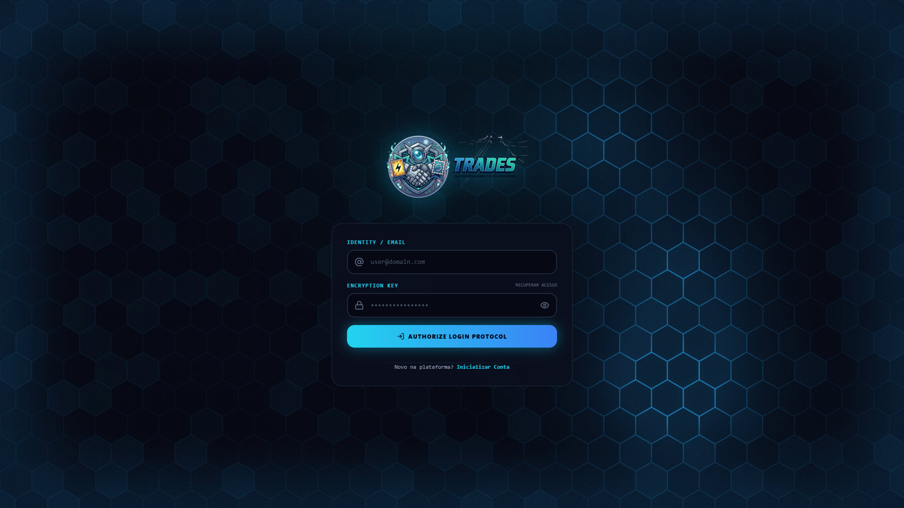
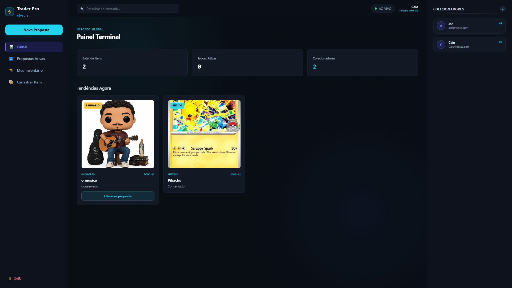
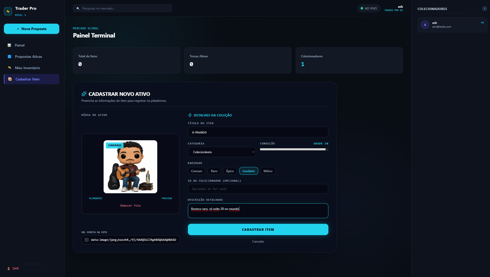
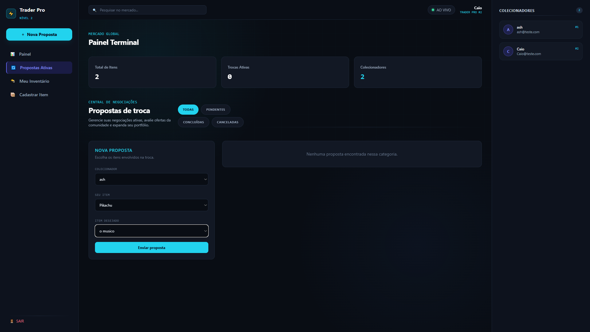
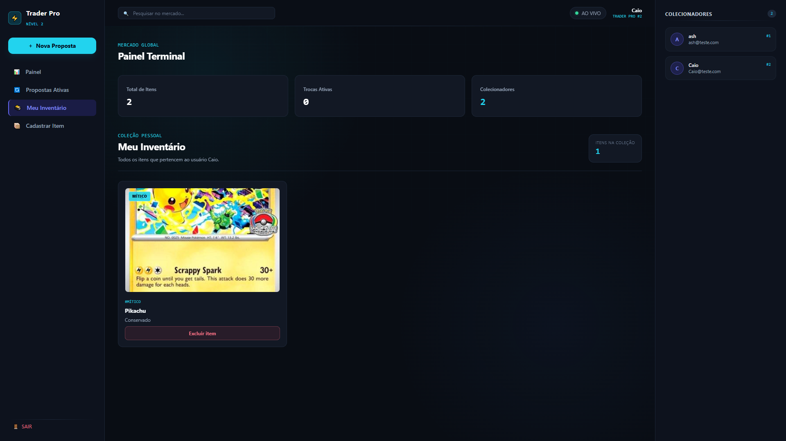

<div align="center">
  
</div>

# 🛡️ Trades: O Hub dos Colecionadores

[](https://github.com/seu-usuario/trades/blob/main/LICENSE)
[](http://makeapullrequest.com)

**Trades** é uma aplicação Full-Stack projetada para a gestão de colecionáveis e mediação de trocas entre usuários. A plataforma combina uma API REST em Node.js com uma interface SPA (Single Page Application) em React para permitir o cadastro de colecionadores, controle de inventários e automação no aceite de propostas de troca em tempo real.

---

## 🚀 Sobre o Projeto

Projeto atualizado para a **Avaliação Parcial (P2)** da disciplina de Desenvolvimento Web. 

A arquitetura do projeto evoluiu da P1 (API REST) para uma **SPA completa (Opção B - React.js)** integrada via API com suporte a CORS, gerenciamento de estado via Hooks (`useState`, `useEffect`) e estilização moderna com Tailwind CSS.

### 🌟 Principais Funcionalidades (CRUD Completo & UX)

* **🗃️ Gestão de Colecionadores:** Cadastro e consulta de perfis na plataforma.
* **📦 Controle de Inventário (CRUD):** 
  * **Criar:** Cadastro de novos ativos com preview de imagem em tempo real e seletor dinâmico de raridade.
  * **Listar:** Exibição em grid/feed responsivo com filtros, badges dinâmicas e estado de conservação.
  * **Editar & Excluir:** Atualização de dados dos itens e remoção de registros do inventário.
* **🔄 Sistema de Trocas:** Criação, visualização e negociação de propostas de troca entre colecionadores.
* **⚡ Transferência Automática:** Atualização instantânea da propriedade do item (`colecionadorId`) ao aceitar uma proposta (`PATCH`).

---

## 🛠️ Tecnologias Utilizadas

### **Front-end (SPA - P2)**
* **Biblioteca Principal:** React.js + Vite
* **Estilização:** Tailwind CSS
* **Ícones & UI:** Lucide React
* **Consumo de API:** Axios
* **Gerenciamento de Estado:** React Hooks (`useState`, `useEffect`)

### **Back-end (API - P1 & P2)**
* **Runtime:** Node.js
* **Linguagem:** TypeScript
* **Framework Web:** Express
* **Comunicação Cross-Origin:** Middleware `cors`
* **Documentação:** Swagger UI (`swagger-ui-express`)
* **Arquitetura:** Clean Architecture (Services, Repositories, Controllers e Factories)

---

## 📖 Documentação da API (Swagger)

ℹ️ A aplicação web estará disponível em http://localhost:5173 .

Com o servidor Node.js rodando, a documentação interativa com todas as rotas e esquemas pode ser acessada em:

👉 **`http://localhost:3000/docs`**

### Rotas Principais

| Método | Endpoint | Descrição |
| :--- | :--- | :--- |
| **POST** | `/api/colecionadores` | Cadastra um novo colecionador |
| **GET** | `/api/colecionadores` | Lista todos os colecionadores |
| **GET / POST** | `/api/itens` | Lista e cadastra novos itens de coleção |
| **PUT / DELETE** | `/api/itens/:id` | Atualiza e remove um item existente |
| **POST** | `/api/propostas` | Cria uma nova proposta de troca |
| **PATCH** | `/api/propostas/:id/responder` | Aceita ou recusa uma proposta de troca |

---

## ⚙️ Como Executar o Projeto

### 1. Back-end (Servidor Node.js)

```bash
# Entre no diretório do servidor/backend
cd backend  # (ou na raiz, caso seu servidor esteja no diretório principal)

# Instale as dependências
npm install

# Inicie o servidor de desenvolvimento
npm run dev
```

### 2. Front-end (Aplicação React)

```bash
# Em um novo terminal, navegue até a pasta do frontend
cd frontend

# Instale as dependências
npm install

# Inicie a aplicação React/Vite
npm run dev
```
## 📸 Guia de Telas

Abaixo estão descritas as principais interfaces da aplicação **Trades**, destacando os recursos visuais e as funcionalidades de interatividade implementadas.

---

### 1. Autenticação e Registro (Login & Criar Conta)
* **Descrição:** Porta de entrada da plataforma, permitindo que o colecionador acesse seu perfil existente ou cadastre uma nova conta.
* **Funcionalidades:** Alternância entre os fluxos de Login e Cadastro de Colecionador, validação de e-mail e persistência da sessão do usuário logado.
* **Destaques de UX:** Layout minimalista centralizado em tema escuro, com validação e mensagens de feedback dinâmicas para contas não encontradas.



### 2. Dashboard Principal (Feed de Ativos)
* **Descrição:** Exibição central de todos os itens cadastrados no repositório em formato de grid responsivo.
* **Funcionalidades:** Busca por nome do item, filtro dinâmico por raridades, ordenação e indicador de status "AO VIVO" com pulso luminoso animado.
* **Destaques de UX:** Cards interativos com iluminação sutil no hover (*glow efeito neon*) e badges atualizadas dinamicamente.



---

### 3. Cadastro de Novo Ativo
* **Descrição:** Formulário completo para registrar novos colecionáveis com pré-visualização no card em tempo real.
* **Funcionalidades:** Área para upload/arraste de imagem (*dropzone*), seletor de raridade (*Comum, Raro, Épico, Lendário, Mítico*), barra de condição (*Grade*) e descrição detalhada.
* **Destaques de UX:** Atualização instantânea da tag de raridade diretamente no selo da imagem do card de preview enquanto o usuário seleciona as opções.



---

### 4. Modal de Proposta de Troca
* **Descrição:** Interface de negociação direta para propor, aceitar ou recusar trocas entre colecionadores.
* **Funcionalidades:** Seleção de itens do próprio inventário para oferta, resumo dos itens envolvidos na transação e atualização automática do proprietário após o aceite (`PATCH`).
* **Destaques de UX:** Fundo escurecido com desfoque suave (*backdrop-blur-md*) e animação tátil de entrada no modal.



---

### 5. Gerenciamento e Edição de Itens (CRUD)
* **Descrição:** Painel do colecionador para controle individual dos seus itens cadastrados.
* **Funcionalidades:** Ações rápidas para **Editar** as informações do ativo ou **Excluir** o registro do inventário com remoção instantânea na tela.



## 🏷️ Release e Entrega Final (P2)

* **Tag Oficial:** `v2.0.0-p2`
* **Título:** Entrega P2 - Interface React (SPA)

### 🎥 Vídeo de Demonstração

[Clique aqui para assistir à demonstração em vídeo (YouTube / Loom / Drive)](https://youtu.be/nL3KDqRDK48)

### 👨‍💻 Desenvolvedor

Desenvolvido por **CAIO GOMES RANGEL** para a Avaliação Parcial P2.
